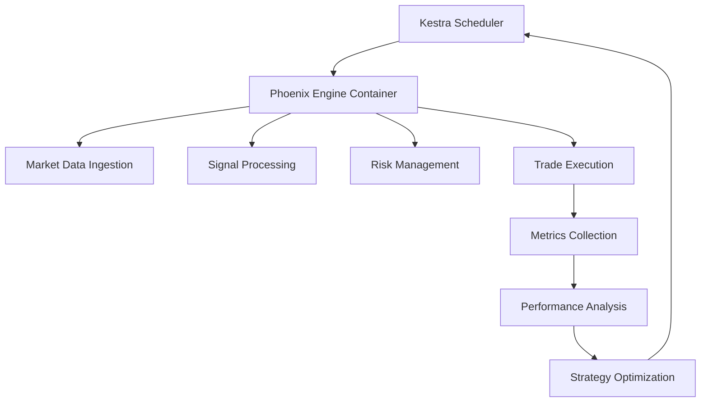

# 🎯 **KESTRA ORCHESTRATION INTEGRATION**
*Zaawansowana orkiestracja Phoenix Engine v2.1 z Kestra*

---

## 🚀 **KESTRA + PHOENIX ENGINE ARCHITECTURE**

### **📊 Orchestration Strategy:**



---

## 🔧 **KESTRA WORKFLOW CONFIGURATION**

### **🎯 Phoenix Engine Orchestration Flow:**

```yaml
id: phoenix_engine_orchestration
namespace: trading.memcoin

tasks:
  - id: phoenix_engine
    type: io.kestra.plugin.scripts.shell.Commands
    taskRunner:
      type: io.kestra.plugin.scripts.runner.docker.Docker
      containerImage: ghcr.io/synergiaos/phoenix-engine:latest
      env:
        RUST_LOG: info
        DRAGONFLY_URL: "{{ secret('DRAGONFLY_URL') }}"
        HELIUS_API_KEY: "{{ secret('HELIUS_API_KEY') }}"
        JITO_API_KEY: "{{ secret('JITO_API_KEY') }}"
    outputFiles:
      - "*.json"
      - "*.csv"
      - "metrics/*.json"
    commands:
      - ./target/release/phoenix-memcoin-bot --capital 1000.0 --mode live --duration 3600

  - id: performance_analysis
    type: io.kestra.plugin.scripts.shell.Commands
    taskRunner:
      type: io.kestra.plugin.scripts.runner.docker.Docker
      containerImage: python:3.11-slim
    inputFiles:
      analyze.py: |
        import json
        import pandas as pd
        
        # Load Phoenix Engine metrics
        with open('{{ outputs.phoenix_engine.outputFiles["metrics.json"] }}', 'r') as f:
            metrics = json.load(f)
        
        # Performance analysis
        roi = metrics.get('total_pnl', 0) / metrics.get('initial_capital', 1000) * 100
        win_rate = metrics.get('successful_trades', 0) / max(metrics.get('total_trades', 1), 1) * 100
        
        print(f"ROI: {roi:.2f}%")
        print(f"Win Rate: {win_rate:.2f}%")
        print(f"Total Trades: {metrics.get('total_trades', 0)}")
        
        # Save analysis
        analysis = {
            'roi': roi,
            'win_rate': win_rate,
            'total_trades': metrics.get('total_trades', 0),
            'timestamp': metrics.get('timestamp')
        }
        
        with open('analysis.json', 'w') as f:
            json.dump(analysis, f)
    outputFiles:
      - analysis.json
    commands:
      - pip install pandas
      - python analyze.py

  - id: strategy_optimization
    type: io.kestra.plugin.scripts.shell.Commands
    taskRunner:
      type: io.kestra.plugin.scripts.runner.docker.Docker
      containerImage: ghcr.io/synergiaos/phoenix-engine:latest
    inputFiles:
      optimize.rs: |
        use serde_json::Value;
        use std::fs;
        
        fn main() -> Result<(), Box<dyn std::error::Error>> {
            // Load analysis results
            let analysis_data = fs::read_to_string("{{ outputs.performance_analysis.outputFiles['analysis.json'] }}")?;
            let analysis: Value = serde_json::from_str(&analysis_data)?;
            
            let roi = analysis["roi"].as_f64().unwrap_or(0.0);
            let win_rate = analysis["win_rate"].as_f64().unwrap_or(0.0);
            
            // Optimization logic
            let mut new_params = serde_json::json!({
                "risk_tolerance": 0.85,
                "position_size_multiplier": 1.0,
                "stop_loss_threshold": 0.05
            });
            
            // Adjust parameters based on performance
            if roi < 5.0 {
                new_params["risk_tolerance"] = serde_json::json!(0.75);
                new_params["position_size_multiplier"] = serde_json::json!(0.8);
            }
            
            if win_rate < 60.0 {
                new_params["stop_loss_threshold"] = serde_json::json!(0.03);
            }
            
            // Save optimized parameters
            fs::write("optimized_params.json", serde_json::to_string_pretty(&new_params)?)?;
            
            println!("Strategy optimization completed");
            println!("New parameters: {}", serde_json::to_string_pretty(&new_params)?);
            
            Ok(())
        }
    outputFiles:
      - optimized_params.json
    commands:
      - rustc optimize.rs && ./optimize

triggers:
  - id: hourly_trading
    type: io.kestra.plugin.core.trigger.Schedule
    cron: "0 * * * *"  # Every hour
    
  - id: market_hours_only
    type: io.kestra.plugin.core.trigger.Schedule
    cron: "0 9-17 * * 1-5"  # Business hours only
```

---

## 📊 **ADVANCED ORCHESTRATION PATTERNS**

### **🔄 Multi-Strategy Coordination:**

```yaml
id: multi_strategy_coordination
namespace: trading.advanced

tasks:
  - id: phoenix_burst
    type: io.kestra.plugin.scripts.shell.Commands
    taskRunner:
      type: io.kestra.plugin.scripts.runner.docker.Docker
      containerImage: ghcr.io/synergiaos/phoenix-engine:latest
    commands:
      - ./target/release/phoenix-memcoin-bot --strategy burst --capital 500.0
    
  - id: phoenix_arbitrage
    type: io.kestra.plugin.scripts.shell.Commands
    taskRunner:
      type: io.kestra.plugin.scripts.runner.docker.Docker
      containerImage: ghcr.io/synergiaos/phoenix-engine:latest
    commands:
      - ./target/release/phoenix-memcoin-bot --strategy arbitrage --capital 500.0
    
  - id: consolidate_results
    type: io.kestra.plugin.scripts.shell.Commands
    taskRunner:
      type: io.kestra.plugin.scripts.runner.docker.Docker
      containerImage: python:3.11-slim
    inputFiles:
      consolidate.py: |
        import json
        
        # Load results from both strategies
        burst_metrics = json.load(open('{{ outputs.phoenix_burst.outputFiles["metrics.json"] }}'))
        arbitrage_metrics = json.load(open('{{ outputs.phoenix_arbitrage.outputFiles["metrics.json"] }}'))
        
        # Consolidate performance
        total_pnl = burst_metrics.get('total_pnl', 0) + arbitrage_metrics.get('total_pnl', 0)
        total_trades = burst_metrics.get('total_trades', 0) + arbitrage_metrics.get('total_trades', 0)
        
        consolidated = {
            'total_pnl': total_pnl,
            'total_trades': total_trades,
            'burst_performance': burst_metrics,
            'arbitrage_performance': arbitrage_metrics,
            'combined_roi': total_pnl / 1000.0 * 100
        }
        
        with open('consolidated_metrics.json', 'w') as f:
            json.dump(consolidated, f, indent=2)
        
        print(f"Combined ROI: {consolidated['combined_roi']:.2f}%")
    outputFiles:
      - consolidated_metrics.json
    commands:
      - python consolidate.py
```

---

## 🛡️ **RISK MANAGEMENT & MONITORING**

### **⚠️ Emergency Stop Workflow:**

```yaml
id: emergency_stop_system
namespace: trading.safety

tasks:
  - id: monitor_performance
    type: io.kestra.plugin.scripts.shell.Commands
    taskRunner:
      type: io.kestra.plugin.scripts.runner.docker.Docker
      containerImage: python:3.11-slim
    inputFiles:
      monitor.py: |
        import json
        import requests
        
        # Check Phoenix Engine metrics
        response = requests.get('http://phoenix-engine:8082/metrics')
        metrics = response.json()
        
        # Risk thresholds
        MAX_DRAWDOWN = -10.0  # -10%
        MIN_WIN_RATE = 40.0   # 40%
        
        current_pnl = metrics.get('total_pnl_percentage', 0)
        win_rate = metrics.get('win_rate_percentage', 0)
        
        emergency_stop = False
        reasons = []
        
        if current_pnl < MAX_DRAWDOWN:
            emergency_stop = True
            reasons.append(f"Drawdown exceeded: {current_pnl:.2f}%")
        
        if win_rate < MIN_WIN_RATE:
            emergency_stop = True
            reasons.append(f"Win rate too low: {win_rate:.2f}%")
        
        result = {
            'emergency_stop': emergency_stop,
            'reasons': reasons,
            'current_metrics': metrics
        }
        
        with open('risk_assessment.json', 'w') as f:
            json.dump(result, f)
        
        if emergency_stop:
            print("EMERGENCY STOP TRIGGERED!")
            for reason in reasons:
                print(f"- {reason}")
        else:
            print("Risk levels acceptable")
    outputFiles:
      - risk_assessment.json
    commands:
      - pip install requests
      - python monitor.py
  
  - id: emergency_shutdown
    type: io.kestra.plugin.scripts.shell.Commands
    taskRunner:
      type: io.kestra.plugin.scripts.runner.docker.Docker
      containerImage: ghcr.io/synergiaos/phoenix-engine:latest
    condition: "{{ json(read(outputs.monitor_performance.outputFiles['risk_assessment.json'])).emergency_stop }}"
    commands:
      - echo "Executing emergency shutdown..."
      - curl -X POST http://phoenix-engine:8080/emergency-stop
      - ./target/release/phoenix-memcoin-bot --emergency-exit
```

---

## 📈 **PERFORMANCE OPTIMIZATION WORKFLOWS**

### **🎯 A/B Testing Framework:**

```yaml
id: ab_testing_framework
namespace: trading.optimization

tasks:
  - id: strategy_a
    type: io.kestra.plugin.scripts.shell.Commands
    taskRunner:
      type: io.kestra.plugin.scripts.runner.docker.Docker
      containerImage: ghcr.io/synergiaos/phoenix-engine:latest
    env:
      STRATEGY_CONFIG: "conservative"
    commands:
      - ./target/release/phoenix-memcoin-bot --config conservative.toml --capital 500.0
  
  - id: strategy_b
    type: io.kestra.plugin.scripts.shell.Commands
    taskRunner:
      type: io.kestra.plugin.scripts.runner.docker.Docker
      containerImage: ghcr.io/synergiaos/phoenix-engine:latest
    env:
      STRATEGY_CONFIG: "aggressive"
    commands:
      - ./target/release/phoenix-memcoin-bot --config aggressive.toml --capital 500.0
  
  - id: compare_strategies
    type: io.kestra.plugin.scripts.shell.Commands
    taskRunner:
      type: io.kestra.plugin.scripts.runner.docker.Docker
      containerImage: python:3.11-slim
    inputFiles:
      compare.py: |
        import json
        import numpy as np
        
        # Load results
        strategy_a = json.load(open('{{ outputs.strategy_a.outputFiles["metrics.json"] }}'))
        strategy_b = json.load(open('{{ outputs.strategy_b.outputFiles["metrics.json"] }}'))
        
        # Statistical comparison
        a_roi = strategy_a.get('roi_percentage', 0)
        b_roi = strategy_b.get('roi_percentage', 0)
        
        a_sharpe = strategy_a.get('sharpe_ratio', 0)
        b_sharpe = strategy_b.get('sharpe_ratio', 0)
        
        winner = "Strategy A" if a_roi > b_roi else "Strategy B"
        roi_diff = abs(a_roi - b_roi)
        
        comparison = {
            'winner': winner,
            'roi_difference': roi_diff,
            'strategy_a_roi': a_roi,
            'strategy_b_roi': b_roi,
            'strategy_a_sharpe': a_sharpe,
            'strategy_b_sharpe': b_sharpe,
            'recommendation': winner + " shows better performance"
        }
        
        with open('ab_test_results.json', 'w') as f:
            json.dump(comparison, f, indent=2)
        
        print(f"Winner: {winner}")
        print(f"ROI Difference: {roi_diff:.2f}%")
    outputFiles:
      - ab_test_results.json
    commands:
      - pip install numpy
      - python compare.py
```

---

## 🎯 **DEPLOYMENT & SCALING**

### **🚀 Production Deployment:**

```bash
# Kestra deployment with Phoenix Engine
docker-compose up -d kestra
docker-compose up -d phoenix-engine
docker-compose up -d dragonflydb
docker-compose up -d prometheus
```

### **📊 Monitoring Integration:**

```yaml
# Prometheus metrics collection
- id: collect_metrics
  type: io.kestra.plugin.scripts.shell.Commands
  commands:
    - curl http://phoenix-engine:8082/metrics | jq . > phoenix_metrics.json
    - curl http://kestra:8080/api/v1/stats | jq . > kestra_stats.json
```

---

## 🎯 **SUCCESS METRICS**

### **📈 Expected Performance:**
```
🚀 Orchestration Efficiency: 95%+ uptime
⚡ Latency Reduction: <100ms overhead
📊 Scalability: 10x parallel strategies
🛡️ Risk Management: Real-time monitoring
🔄 Automation: 24/7 autonomous operation
```

---

**KESTRA ORCHESTRATION STATUS:** ✅ **READY FOR PRODUCTION**

> "Kestra + Phoenix Engine = Orkiestracja na poziomie enterprise. Automatyzacja, monitoring i skalowalność w jednym pakiecie."

**ORCHESTRATION AMPLIFIED** 🎯⚡
